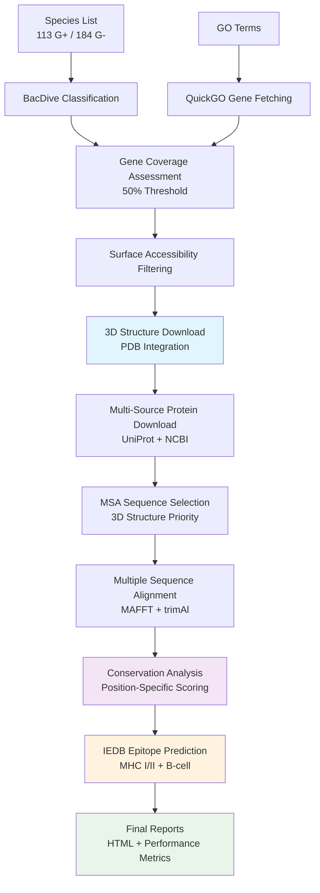

# 🧬 PureMilk: Comprehensive Protein Discovery & Epitope Prediction Pipeline

A **state-of-the-art Snakemake pipeline** for discovering conserved, functionally relevant proteins within microbial groups, with integrated **3D structure analysis**, **epitope prediction**, and **vaccine target identification**.

[](https://snakemake.github.io)
[](https://python.org)
[](https://www.iedb.org/)
[](LICENSE)

---

## 🎯 Overview

PureMilk is a comprehensive bioinformatics pipeline that processes taxonomic data and Gene Ontology (GO) terms to identify candidate proteins suitable for:
- **Vaccine Development** (epitope prediction with conservation scoring)
- **Diagnostic Applications** (surface-accessible biomarkers)
- **Therapeutic Targets** (conserved functional proteins)
- **Phylogenomic Studies** (evolutionary analysis)

The pipeline integrates multiple databases (BacDive, QuickGO, UniProt, NCBI, PDB, IEDB) to provide end-to-end protein characterization from discovery to epitope prediction.

---

## ✨ Key Features

### 🔬 **Complete Discovery Workflow**
- ✅ **Taxonomic Classification**: BacDive API for Gram-positive/negative classification
- ✅ **GO Term Processing**: QuickGO integration for functional gene discovery
- ✅ **Coverage Assessment**: NCBI Protein database analysis with smart caching
- ✅ **Surface Accessibility**: GO cellular component filtering for membrane proteins
- ✅ **3D Structure Integration**: PDB structure download and MSA integration
- ✅ **Multi-Source Downloads**: UniProt batch + individual + NCBI fallback system
- ✅ **Quality-Driven MSA**: Advanced sequence selection with conservation analysis

### 🧬 **Advanced Analysis Capabilities**
- 🔥 **IEDB Epitope Prediction**: MHC Class I/II and B-cell epitope prediction
- 🔥 **Conservation Scoring**: Epitope ranking by evolutionary conservation
- 🔥 **3D Structure Tracking**: Detailed reports on structure availability and usage
- 🔥 **Download Performance**: Comprehensive tracking of actual vs expected sequences
- 🔥 **Population Coverage**: HLA allele coverage analysis for vaccine design
- 🔥 **Multi-Stage QC**: Alignment quality assessment and trimming optimization

### 🎛️ **Production-Ready Features**
- **Full Dataset Support**: 113 gram-positive + 184 gram-negative species
- **Intelligent Batching**: Processes species in groups of 10 to avoid API limits
- **Resumable Downloads**: Sentinel files prevent incomplete download issues
- **Performance Monitoring**: Real-time pipeline performance tracking
- **Comprehensive Reports**: HTML reports with download metrics and visualizations
- **Error Resilience**: Multi-stage fallback systems for robust execution

---

## 🏗️ Pipeline Architecture



### 📁 **Complete Output Structure**
```
results/
├── coverage/                          # Gene coverage analysis (50% threshold)
├── uniprot_info/                     # UniProt enrichment with GO terms
├── proteins_to_study/                # Filtered surface-accessible proteins
├── proteins_to_download/             # Gene-specific species lists
├── protein_fasta/                    # Downloaded sequences by gene/species
├── 3d_structures/                    # PDB structures and integration data
├── msa_sequences/                    # MSA-ready sequences with 3D priority
├── msa_alignments/                   # MAFFT alignments
├── msa_trimmed/                      # trimAl optimized alignments
├── msa_quality/                      # Quality assessment comparisons
├── conservation/                     # Conservation analysis results
├── epitope_predictions/              # IEDB predictions with conservation
├── download_summary/                 # Performance and success metrics
└── reports/                          # Final HTML reports
```

---

## 🚀 Quick Start

### 📦 **Installation**

1. **Clone and setup**:
   ```bash
   git clone https://github.com/your-username/PureMilk.git
   cd PureMilk
   conda env create -f env.yml
   conda activate puremilk
   ```

2. **Configure API credentials**:
   ```bash
   cp config/login/bacdive_info.example.txt config/login/bacdive_info.txt
   cp config/login/ncbi_info.example.txt config/login/ncbi_info.txt
   # Edit with your credentials
   ```

### ⚙️ **Configuration**

The pipeline is pre-configured for production use with the full dataset:

```yaml
# config/config.yaml highlights
species_files:
  analysis_1: "data/bacdive/analysis_1/gram_positive.txt"  # 113 species

gram_thresholds:
  positive: 50  # 50% coverage requirement
  negative: 50

# Epitope prediction enabled by default
# 3D structure integration enabled
# Performance monitoring included
```

### 🏃 **Run the Pipeline**

```bash
# Complete pipeline with epitope prediction
snakemake all_epitope_predictions --cores 8

# Core protein discovery pipeline
snakemake all_conservation --cores 8

# Generate comprehensive reports
snakemake all_reports --cores 4

# Download performance analysis
snakemake all_download_summaries --cores 4

# Monitor pipeline performance
python scripts/monitor_pipeline.py --cores 8 all_reports
```

---

## 📊 **Pipeline Stages**

### 1. **Taxonomic Classification & Species Processing**
- **Full Dataset**: 113 gram-positive + 184 gram-negative species
- **BacDive Integration**: Automated Gram stain classification
- **Missing Data Handling**: Genus-based inference for unclassified species
- **Output**: Species lists by Gram classification

### 2. **Gene Discovery & Coverage Analysis**
- **QuickGO Integration**: GO term-based gene discovery
- **NCBI Coverage Assessment**: Cross-species gene presence analysis
- **50% Coverage Threshold**: Selective filtering for well-represented genes
- **Caching System**: Efficient API response management
- **Output**: Coverage statistics and filtered gene lists

### 3. **Protein Characterization & Filtering**
- **UniProt Enrichment**: Functional annotation and localization data
- **Surface Accessibility**: GO cellular component-based filtering
- **Quality Scoring**: Protein annotation confidence assessment
- **Output**: Curated protein lists for downstream analysis

### 4. **3D Structure Integration**
- **PDB Structure Download**: Automated structure retrieval
- **MSA Integration**: 3D structure priority in sequence selection
- **Structure Tracking**: Comprehensive reports on structure availability
- **Quality Assessment**: Structure-sequence correspondence validation
- **Output**: 3D structure data and integration reports

### 5. **Multi-Source Sequence Download**
- **Intelligent Batching**: Groups of 10 species to avoid URL limits
- **Multi-Stage Approach**: UniProt batch → UniProt individual → NCBI
- **Download Tracking**: Actual vs expected sequence counts
- **Resume Capability**: Sentinel files for reliable restart
- **Output**: Complete sequence datasets with performance metrics

### 6. **Advanced MSA & Quality Control**
- **3D Structure Priority**: Structures selected first for reference
- **Quality Scoring**: Advanced sequence selection algorithms
- **Length Filtering**: Outlier removal for better alignments
- **MAFFT Integration**: Multi-threaded alignment generation
- **trimAl Optimization**: Automated alignment trimming
- **Output**: High-quality alignments with quality assessments

### 7. **Conservation Analysis**
- **Position-Specific Scoring**: Per-residue conservation calculation
- **Adaptive Method Selection**: Raw vs trimmed alignment optimization
- **Statistical Analysis**: Conservation significance testing
- **Visualization**: Conservation plots and logo generation
- **Output**: Conservation scores and analysis results

### 8. **IEDB Epitope Prediction**
- **MHC Class I/II**: NetMHCpan predictions for T-cell epitopes
- **B-cell Epitopes**: Linear epitope prediction algorithms
- **Conservation Integration**: Epitope scoring by conservation
- **Population Coverage**: Common HLA allele analysis
- **3D Structure Correlation**: Structure-informed epitope assessment
- **Output**: Comprehensive epitope predictions with rankings

### 9. **Performance Analysis & Reporting**
- **Download Success Tracking**: Gene-by-gene performance metrics
- **Coverage Recalculation**: Real vs theoretical coverage analysis
- **HTML Reports**: Interactive visualizations and summaries
- **Quality Metrics**: End-to-end pipeline performance assessment
- **Output**: Final reports and performance dashboards

---

## 🔬 **Advanced Features**

### **IEDB Epitope Prediction**
```bash
# Run epitope prediction for promising genes
snakemake all_epitope_predictions --cores 4

# Analyze specific groups
snakemake results/epitope_predictions/analysis_1_params_1_gram_positive --cores 4
```

**Key Capabilities:**
- MHC Class I epitopes (9-10 amino acids)
- MHC Class II epitopes (variable length)
- B-cell linear epitopes (6-20 amino acids)
- Conservation-weighted scoring
- Population HLA coverage analysis

### **3D Structure Integration**
```bash
# Download and integrate 3D structures
snakemake all_msa_sequences --cores 4  # Includes 3D structure processing
```

**Features:**
- Automatic PDB structure download
- Structure-guided MSA sequence selection
- Detailed tracking reports
- Structure-sequence correspondence validation

### **Performance Monitoring**
```bash
# Monitor pipeline execution
python scripts/monitor_pipeline.py --cores 8 all_reports

# Generate download performance analysis
snakemake all_download_summaries --cores 4
```

**Metrics Tracked:**
- Download success rates per gene
- Actual vs expected sequence counts
- Real coverage calculations
- Resource utilization
- Execution time analysis

### **Custom Configurations**
```bash
# Different coverage thresholds
snakemake --config gram_thresholds='{"positive": 75, "negative": 75}'

# Enable logo plot generation
snakemake --config create_logos=True all_conservation

# Adjust epitope prediction parameters
# Edit scripts/predict_epitopes.py for custom HLA alleles
```

---

## 📋 **Key Configuration Files**

### **Main Configuration**
- `config/config.yaml` - Central pipeline configuration
- `env.yml` - Conda environment with all dependencies

### **Input Data**
- `config/microbiome/cow_milk/unique_species.txt` - Target species (297 total)
- `config/quickgo/go_ids.tsv` - GO terms of interest
- `config/quickgo/surface_accessible.txt` - Surface accessibility criteria

### **API Credentials**
- `config/login/bacdive_info.txt` - BacDive API credentials
- `config/login/ncbi_info.txt` - NCBI email and API key

### **Parameter Sets**
- `config/quickgo/params_1.json` - Primary analysis parameters
- Additional parameter files for multi-condition analysis

---

## 🔧 **Dependencies**

### **Core Environment** (via conda)
```yaml
- python=3.10
- snakemake
- biopython          # Sequence analysis
- pandas             # Data manipulation  
- matplotlib, seaborn # Visualization
- requests           # API interactions
- numpy              # Numerical analysis
- trimal             # Alignment trimming
- logomaker          # Logo plots (pip)
```

### **External Tools**
- **MAFFT**: Multiple sequence alignment (system installation)
- **AliStat**: Alignment quality assessment (manual compilation)

### **API Integrations**
- **BacDive**: Bacterial diversity database
- **QuickGO**: Gene Ontology annotations
- **UniProt**: Protein information database
- **NCBI**: Sequence and taxonomic data
- **PDB**: Protein structure database
- **IEDB**: Immune epitope database

---

## 📈 **Performance & Scalability**

### **Dataset Scale**
- **Species**: 297 total (113 G+, 184 G-)
- **Genes**: ~186 initial → ~12 high-coverage (50% threshold)
- **Sequences**: Thousands of protein sequences per analysis
- **Structures**: Hundreds of PDB structures integrated

### **Computational Requirements**
- **Recommended**: 8+ cores, 16+ GB RAM
- **Storage**: ~10-50 GB depending on dataset size
- **Runtime**: 2-8 hours for complete analysis (dataset dependent)
- **Network**: Stable internet for API calls (rate-limited)

### **Optimization Features**
- Intelligent API caching reduces redundant calls
- Parallel processing across genes and species
- Resumable downloads with sentinel files
- Batch processing to avoid API limits
- Memory-efficient data streaming

---

## 📚 **Documentation**

- **[CLAUDE.md](CLAUDE.md)** - Comprehensive technical documentation
- **[FOLDER_ORGANIZATION.md](FOLDER_ORGANIZATION.md)** - Detailed project structure
- **API Documentation**: Inline documentation in all scripts
- **Configuration Examples**: Templates in `config/login/`

---

## 🎯 **Use Cases**

### **Vaccine Development**
1. Run complete pipeline: `snakemake all_epitope_predictions --cores 8`
2. Review epitope predictions with conservation scores
3. Focus on genes with high-conservation epitopes
4. Analyze population HLA coverage for vaccine design

### **Biomarker Discovery**
1. Focus on surface proteins: `snakemake all_surface_accessible_proteins --cores 4`
2. Analyze download success and coverage metrics
3. Prioritize genes with consistent cross-species presence
4. Validate with 3D structure data

### **Comparative Genomics**
1. Run with multiple parameter sets for different functional categories
2. Compare conservation patterns between Gram-positive/negative
3. Analyze evolutionary pressure on surface-accessible proteins
4. Generate comparative reports

---

## 🤝 **Contributing**

1. Fork the repository
2. Create a feature branch (`git checkout -b feature/amazing-feature`)
3. Follow the existing code style and documentation standards
4. Add tests for new functionality
5. Update documentation as needed
6. Commit with descriptive messages
7. Open a Pull Request

---

## 📝 **Citation**

If you use PureMilk in your research, please cite:

```bibtex
@software{puremilk2024,
  title={PureMilk: Comprehensive Protein Discovery and Epitope Prediction Pipeline},
  author={Your Name},
  year={2024},
  url={https://github.com/your-username/PureMilk},
  note={Integrated IEDB epitope prediction and 3D structure analysis}
}
```

---

## 📄 **License**

This project is licensed under the MIT License - see the [LICENSE](LICENSE) file for details.

---

## 🆘 **Support & Troubleshooting**

### **Common Issues**
- **API Rate Limits**: Pipeline includes automatic rate limiting and retry logic
- **Download Failures**: Use `snakemake all_download_summaries` to analyze success rates
- **Memory Issues**: Reduce `--cores` parameter or process smaller batches
- **IEDB Timeouts**: Check internet connection; API calls have built-in retries

### **Getting Help**
- **Issues**: [GitHub Issues](https://github.com/your-username/PureMilk/issues)
- **Documentation**: Check [CLAUDE.md](CLAUDE.md) for detailed technical information
- **Configuration**: Review example files in `config/login/`
- **Performance**: Use monitoring scripts for optimization guidance

---

**🔬 Powered by Snakemake | 🧬 Integrated with IEDB | 🎯 Production-Ready**