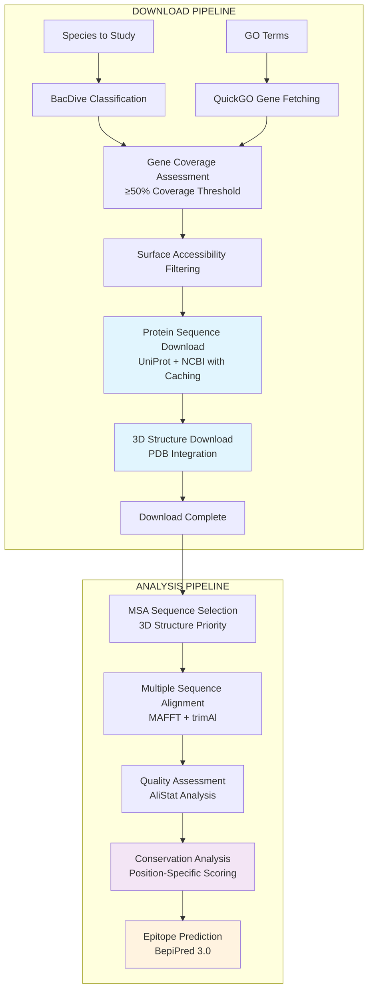

# 🎯 TargSeek: Protein Discovery & Epitope Prediction Pipeline

A **dual Snakemake pipeline system** for discovering conserved, functionally relevant proteins within microbial groups, with integrated **3D structure analysis** and **epitope prediction**.

[](https://snakemake.github.io)
[](https://python.org)
[](LICENSE)

---

## 🎯 Overview

TargSeek identifies candidate proteins suitable for **vaccine development**, **diagnostic applications**, and **therapeutic targets** by processing taxonomic data and Gene Ontology terms to find conserved, surface-accessible proteins.

**Key Capabilities:**
- Dual-pipeline architecture: Download → Analysis workflow
- Taxonomic classification and gene coverage assessment
- Surface accessibility filtering for membrane proteins
- 3D structure integration from PDB
- Multiple sequence alignment with conservation analysis  
- BepiPred 3.0 B-cell epitope prediction with conservation scoring

---

## 🏗️ Pipeline Architecture

### **Two-Stage Pipeline System:**



### 📁 Output Structure
```
results/{analysis}_{paramset}/
├── gene_selection/              # Download pipeline outputs
│   ├── coverage_count.tsv      # Gene coverage analysis
│   ├── summary.tsv             # Selected proteins summary
│   ├── selected_genes_gram_*.txt # Gene lists by Gram type
│   └── genes_species/          # Gene-specific species lists
└── protein_analysis/           # Analysis pipeline outputs
    ├── msa_sequence_refs/      # MSA reference sequences
    ├── no_3d/                  # Analysis without 3D structures
    │   ├── msa_sequences/      # FASTA files for MSA
    │   ├── msa_alignments/     # MAFFT alignments
    │   ├── msa_trimmed/        # trimAl optimized alignments
    │   ├── msa_quality/        # AliStat quality assessment
    │   └── conservation/       # Conservation analysis
    ├── with_3d/               # Analysis with 3D structures
    │   └── [same structure]
    └── epitope_predictions_bepipred/ # BepiPred 3.0 results
```

---

## 🚀 Quick Start

### 📦 Installation

```bash
# Clone and setup environment
git clone https://github.com/CatiaBio/TargSeek.git
cd TargSeek
conda env create -f env.yml
conda activate targseek
```

### ⚙️ Configuration

```bash
# Setup API credentials
cp config/login/bacdive_info.example.txt config/login/bacdive_info.txt
cp config/login/ncbi_info.example.txt config/login/ncbi_info.txt
# Edit files with your credentials
```

### 🏃 Run Pipeline

```bash
# STEP 1: Download Pipeline (required first)
snakemake -s Snakefile_download all_download_data --cores 8

# STEP 2: Analysis Pipeline
snakemake -s Snakefile_analysis all_analysis --cores 8

# Individual stages (for testing/debugging)
snakemake -s Snakefile_download all_species_classification --cores 4
snakemake -s Snakefile_analysis all_sequence_preparation --cores 4

# Monitor progress
snakemake -s Snakefile_download --dry-run  # Check download workflow
snakemake -s Snakefile_analysis --dry-run  # Check analysis workflow
```

---

## 🔬 Key Features

### **Dual Pipeline Architecture**
- **Download Pipeline**: Data collection, classification, and sequence downloads
- **Analysis Pipeline**: MSA, conservation analysis, and epitope prediction
- **Independent execution**: Run stages separately for flexibility
- **Clear separation**: Download data once, analyze multiple times

### **Intelligent Caching System**
- **Protein sequences**: Avoids re-downloading existing sequences
- **3D structures**: Caches PDB structure searches and downloads
- **Gene coverage**: Persistent NCBI API call caching
- **Cache management**: `utils/cache/` utilities for backup/restore

### **Enhanced Download Strategy**
- **Multi-source**: UniProt batch → individual → NCBI fallback
- **Alias support**: Uses gene aliases when primary names fail
- **Resumable**: Sentinel files prevent incomplete downloads
- **Shared data**: Organized by gene in `data/protein_sequences/`

### **Advanced Analysis**
- **Coverage-based selection**: Only proteins with ≥50% species coverage
- **Surface accessibility**: GO cellular component filtering
- **3D structure priority**: Structures selected first for MSA
- **Dual MSA approach**: With and without 3D structures
- **Quality assessment**: AliStat-based alignment evaluation
- **Conservation scoring**: Position-specific conservation analysis

---

## 📊 Pipeline Stages

### **DOWNLOAD PIPELINE** (`Snakefile_download`)

#### 1. **Species Processing & Classification**
- BacDive API for Gram-positive/negative classification
- Genus-based inference for missing classifications
- **Output**: Species lists by Gram type

#### 2. **Gene Discovery & Coverage**
- QuickGO integration for GO term-based gene discovery
- NCBI coverage assessment across species
- **≥50% coverage threshold** for gene selection
- **Output**: High-coverage gene lists

#### 3. **Protein & Structure Downloads**
- Surface accessibility filtering using GO annotations
- Multi-source download with caching system
- PDB structure download and integration
- **Output**: Curated protein sequences and 3D structures

### **ANALYSIS PIPELINE** (`Snakefile_analysis`)

#### 4. **Sequence Preparation**
- MSA-ready sequence selection with 3D structure priority
- Separate preparation for with/without 3D structure analysis
- **Output**: Organized FASTA files for alignment

#### 5. **Multiple Sequence Alignment**
- MAFFT alignment with configurable parameters
- trimAl automated trimming for optimal alignments
- **Output**: High-quality alignments

#### 6. **Quality Assessment**
- AliStat quality metrics before and after trimming
- Alignment statistics and evaluation
- **Output**: Quality assessment reports

#### 7. **Conservation Analysis**
- Position-specific conservation scoring
- Conserved region identification
- **Output**: Conservation analysis results

#### 8. **Epitope Prediction**
- BepiPred 3.0 B-cell epitope prediction on 3D structures
- **Output**: Ranked epitope candidates

---

## 🔧 Dependencies

**Core Tools** (via conda):
- `snakemake` - Workflow management
- `biopython` - Sequence analysis
- `pandas` - Data manipulation
- `mafft` - Multiple sequence alignment
- `trimal` - Alignment trimming

**External APIs**:
- **BacDive**: Bacterial classification
- **QuickGO**: Gene Ontology annotations
- **UniProt**: Protein sequences and information
- **NCBI**: Protein database
- **PDB**: 3D structures

**Optional**:
- **BepiPred 3.0**: Advanced B-cell epitope prediction (Ubuntu setup required)
- **AliStat**: Alignment quality assessment (manual compilation required)

---

## 📁 Project Organization

```
TargSeek/
├── Snakefile_download          # Download pipeline workflow
├── Snakefile_analysis          # Analysis pipeline workflow
├── env.yml                     # Conda environment
├── CLAUDE.md                   # Technical documentation
├── USAGE_DOWNLOAD.txt          # Download pipeline usage guide
├── USAGE_ANALYSIS.txt          # Analysis pipeline usage guide
├── config/                     # Configuration files
│   ├── config_download.yaml   # Download pipeline config
│   ├── config_analysis.yaml   # Analysis pipeline config
│   ├── login/                  # API credentials
│   ├── microbiome/            # Species lists by analysis
│   └── quickgo/               # GO terms and parameters
├── scripts/                    # Pipeline scripts
│   ├── gene_selection/        # Download pipeline scripts
│   └── protein_analysis/      # Analysis pipeline scripts
├── utils/                      # Utility scripts
│   ├── cache/                 # Cache management utilities
│   ├── setup/                 # Installation scripts
│   └── migration/             # Data migration utilities
├── docs/                       # Documentation files
├── archive/                    # Archived files
├── cache/                      # Persistent API caches
├── data/                       # Raw and processed data
├── results/                    # Pipeline analysis outputs
└── tools/                      # External tools (BepiPred, etc.)
```

---

## 🎯 Use Cases

**Complete Protein Discovery Workflow**:
```bash
# 1. Download all data
snakemake -s Snakefile_download all_download_data --cores 8

# 2. Run complete analysis
snakemake -s Snakefile_analysis all_analysis --cores 8
```

**Development and Testing**:
```bash
# Test download pipeline stages
snakemake -s Snakefile_download all_species_classification --cores 4
snakemake -s Snakefile_download all_gene_selection --cores 4

# Test analysis pipeline stages
snakemake -s Snakefile_analysis all_sequence_preparation --cores 4
snakemake -s Snakefile_analysis all_alignments --cores 4
```

**Epitope Prediction Focus**:
```bash
# After download pipeline completion
snakemake -s Snakefile_analysis all_predictions_and_reports --cores 4
```

---

## 📚 Documentation

- **[CLAUDE.md](CLAUDE.md)** - Comprehensive technical documentation and project guidance
- **[USAGE_DOWNLOAD.txt](USAGE_DOWNLOAD.txt)** - Download pipeline usage guide with examples
- **[USAGE_ANALYSIS.txt](USAGE_ANALYSIS.txt)** - Analysis pipeline usage guide with examples
- **[docs/](docs/)** - Additional documentation files

For detailed configuration, troubleshooting, and advanced usage, see the specific usage guides and [CLAUDE.md](CLAUDE.md).

---

## 📝 Citation

If you use TargSeek in your research, please cite:

```bibtex
@software{baptista2024targseek,
  title={TargSeek: Protein Discovery and Epitope Prediction Pipeline},
  author={Cátia Baptista},
  year={2024},
  url={https://github.com/CatiaBio/TargSeek},
  note={Dual Snakemake pipeline for conserved protein discovery with integrated 3D structure analysis and epitope prediction}
}
```

**Alternative citation format:**
> Baptista, C. (2024). TargSeek: Protein Discovery and Epitope Prediction Pipeline. GitHub. https://github.com/CatiaBio/TargSeek

## 📝 License

This project is licensed under the MIT License - see the [LICENSE](LICENSE) file for details.

---

## 📚 References

TargSeek integrates multiple bioinformatics tools and databases. If you use this pipeline, please cite the relevant resources:

### **🧬 Core Tools**
- **MAFFT**: Katoh, K., & Standley, D. M. (2013). MAFFT multiple sequence alignment software version 7. *Molecular Biology and Evolution*, 30(4), 772-780.
- **trimAl**: Capella-Gutiérrez, S., et al. (2009). trimAl: automated alignment trimming in large-scale phylogenetic analyses. *Bioinformatics*, 25(15), 1972-1973.
- **BepiPred 3.0**: Clifford, J. N., et al. (2022). BepiPred-3.0: Improved B-cell epitope prediction using protein language models. *Protein Science*, 31(12), e4497.
- **Snakemake**: Köster, J., & Rahmann, S. (2012). Snakemake—a scalable bioinformatics workflow engine. *Bioinformatics*, 28(19), 2520-2522.

### **🌐 Databases & APIs**
- **UniProt**: UniProt Consortium. (2023). UniProt: the Universal Protein Knowledgebase in 2023. *Nucleic Acids Research*, 51(D1), D523-D531.
- **NCBI**: Sayers, E. W., et al. (2024). Database resources of the National Center for Biotechnology Information in 2024. *Nucleic Acids Research*, 52(D1), D33-D43.
- **RCSB PDB**: Berman, H. M., et al. (2000). The Protein Data Bank. *Nucleic Acids Research*, 28(1), 235-242.
- **BacDive**: Reimer, L. C., et al. (2019). BacDive in 2019: bacterial phenotypic data for biodiversity analysis. *Nucleic Acids Research*, 47(D1), D631-D636.
- **QuickGO**: Binns, D., et al. (2009). QuickGO: a web-based tool for Gene Ontology searching. *Bioinformatics*, 25(22), 3045-3046.