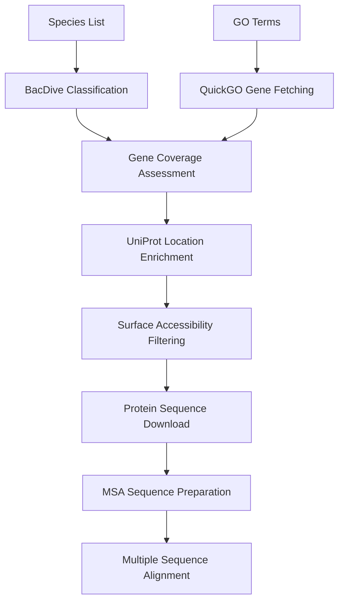

# 🧬 PureMilk: Surface-Accessible Protein Discovery Pipeline

A **Snakemake-based pipeline** for discovering conserved, functionally relevant proteins within specific microbial groups, with a focus on **surface-accessible proteins** suitable for diagnostic applications, therapeutic targets, or phylogenomic studies.

[](https://snakemake.github.io)
[](https://python.org)
[](LICENSE)

---

## 🎯 Overview

PureMilk processes taxonomic data and Gene Ontology (GO) terms to extract candidate proteins that are:
- **Surface-accessible** (based on GO cellular component annotations)
- **Conserved** across target bacterial species
- **Functionally relevant** for downstream applications

The pipeline integrates multiple databases (BacDive, QuickGO, UniProt, NCBI) to provide comprehensive protein characterization and sequence data.

---

## ✨ Key Features

### 🔬 **Complete Workflow**
- ✅ **Taxonomic Classification**: Uses BacDive API to classify species as Gram-positive/negative
- ✅ **GO Term Processing**: Fetches gene symbols from QuickGO based on provided GO terms
- ✅ **Coverage Assessment**: Analyzes gene presence across target taxa using NCBI Protein database
- ✅ **Surface Accessibility Filtering**: Identifies proteins with surface-accessible GO cellular components
- ✅ **UniProt Integration**: Enriches protein data with subcellular location and functional annotations
- ✅ **Smart Downloads**: Downloads protein sequences with intelligent file existence checking
- ✅ **MSA Preparation**: Prepares sequences for multiple sequence alignment with advanced species matching

### 🎛️ **Advanced Capabilities**
- **Configurable Parameters**: Multiple analysis configurations and parameter sets
- **Caching System**: Efficient API response caching to reduce redundant calls
- **Error Resilience**: Comprehensive error handling and retry mechanisms
- **Progress Tracking**: Detailed logging and progress monitoring
- **Resumable Workflows**: Smart file checking prevents unnecessary re-downloads

---

## 🏗️ Pipeline Architecture



### 📁 **Output Structure**
```
results/
├── coverage/                    # Gene coverage analysis
├── uniprot_info/               # UniProt data with GO enrichment
├── proteins_to_study/          # Filtered surface-accessible proteins
├── proteins/                   # Downloaded protein sequences
└── msa_sequences/             # MSA-ready sequences
```

---

## 🚀 Quick Start

### 📦 **Installation**

1. **Clone the repository**:
   ```bash
   git clone https://github.com/your-username/PureMilk.git
   cd PureMilk
   ```

2. **Create conda environment**:
   ```bash
   conda env create -f env.yml
   conda activate puremilk
   ```

3. **Configure API credentials**:
   ```bash
   # Copy example files and add your credentials
   cp config/login/bacdive_info.example.txt config/login/bacdive_info.txt
   cp config/login/ncbi_info.example.txt config/login/ncbi_info.txt
   
   # Edit files with your API credentials
   nano config/login/bacdive_info.txt    # Add BacDive credentials
   nano config/login/ncbi_info.txt       # Add NCBI email and API key
   ```

### ⚙️ **Configuration**

Edit `config/config.yaml` to customize your analysis:

```yaml
# Species data
species_files:
  analysis_1: "config/microbiome/cow_milk/unique_species.txt"

# GO terms and parameters  
quickgo_paramsets: ["params_1", "params_2"]

# Coverage thresholds
gram_thresholds:
  positive: 25  # Minimum 25% species coverage
  negative: 25

# Surface accessibility criteria
surface_accessible_file: "config/quickgo/surface_accessible.txt"
```

### 🏃 **Run the Pipeline**

```bash
# Run complete pipeline
snakemake all_msa_sequences --cores 8

# Run specific stages
snakemake all_surface_accessible_proteins --cores 4  # Filter proteins
snakemake all_downloaded_proteins --cores 4          # Download sequences
snakemake all_msa_sequences --cores 4                # Prepare for MSA

# Dry run to check workflow
snakemake --dry-run

# Run with minimal output
snakemake all_msa_sequences --cores 4 --quiet
```

---

## 📊 **Pipeline Stages**

### 1. **Taxonomic Classification**
- Classifies input species as Gram-positive or Gram-negative using BacDive
- Handles missing data with genus-based inference
- **Output**: `data/bacdive/{analysis}/gram_{group}.txt`

### 2. **Gene Symbol Extraction**
- Fetches genes associated with input GO terms via QuickGO API
- Filters gene symbols based on naming conventions
- **Output**: `data/quickgo/{paramset}/gene_symbols_filtered.txt`

### 3. **Coverage Assessment**
- Analyzes gene presence across target species using NCBI Protein database
- Calculates coverage percentages and species counts
- **Output**: `results/coverage/{analysis}_{paramset}_gram_{group}_coverage_count.tsv`

### 4. **UniProt Enrichment**
- Fetches protein information from UniProt (bacteria-specific, taxon ID 2)
- Adds GO cellular component and subcellular location data
- **Output**: `results/uniprot_info/.../coverage_count_location.tsv`

### 5. **Surface Accessibility Filtering**
- Filters proteins based on GO cellular component annotations
- Uses configurable surface accessibility criteria
- **Output**: `results/proteins_to_study/{analysis}_{paramset}_gram_{group}.tsv`

### 6. **Protein Download**
- Downloads protein sequences from NCBI for filtered genes
- Smart file checking prevents re-downloads
- **Output**: `results/proteins/{analysis}_{paramset}_gram_{group}/{gene}/`

### 7. **MSA Preparation**
- Selects representative sequences per species for each gene
- Advanced species name matching from FASTA headers
- **Output**: `results/msa_sequences/{analysis}_{paramset}_gram_{group}/{gene}.fasta`

---

## 📋 **Configuration Files**

### **Species Lists**
- `config/microbiome/{analysis}.txt` - Target species for analysis

### **GO Terms**
- `config/quickgo/go_ids.tsv` - GO terms of interest
- `config/quickgo/taxon_ids.tsv` - Taxonomic restrictions
- `config/quickgo/surface_accessible.txt` - Surface accessibility criteria

### **Parameters**
- `config/quickgo/params_{n}.json` - Parameter sets for different analyses

---

## 🔧 **Advanced Usage**

### **Multiple Analyses**
Run different parameter combinations:
```bash
# Process multiple parameter sets
snakemake --config quickgo_paramsets='["params_1","params_2","params_3"]'

# Different species sets
snakemake --config species_batches='["analysis_1","analysis_2"]'
```

### **Custom Surface Criteria**
Edit `config/quickgo/surface_accessible.txt` to modify surface accessibility criteria:
```
cell outer membrane
cell surface  
extracellular region
bacterial-type flagellum
# Add your criteria...
```

### **Debugging**
```bash
# Verbose output
snakemake all_msa_sequences --cores 4 -p

# Force re-run specific rule
snakemake results/proteins_to_study/analysis_1_params_1_gram_positive.tsv --forcerun

# Generate workflow visualization
snakemake --dag | dot -Tsvg > workflow.svg
```

---

## 📚 **Dependencies**

### **Core Tools** (managed via conda)
- **Snakemake** (≥6.0) - Workflow management
- **Python** (≥3.8) - Scripting and data processing
- **Biopython** - Sequence parsing and API interactions
- **Pandas** - Data manipulation and analysis
- **Requests** - API interactions

### **External Tools**
- **MAFFT** - Multiple sequence alignment (optional)
- **trimAl** - Alignment trimming (optional)

### **APIs Used**
- **BacDive** - Taxonomic classification
- **QuickGO** - GO term annotations  
- **UniProt** - Protein information
- **NCBI Protein** - Sequence data

---

## 📖 **Documentation**

- **[CLAUDE.md](CLAUDE.md)** - Detailed project instructions and architecture
- **[FOLDER_ORGANIZATION.md](FOLDER_ORGANIZATION.md)** - Project structure and file organization
- **Configuration examples** in `config/login/*.example.txt`

---

## 🤝 **Contributing**

1. Fork the repository
2. Create a feature branch (`git checkout -b feature/amazing-feature`)
3. Make your changes and test thoroughly
4. Commit your changes (`git commit -m 'Add amazing feature'`)
5. Push to the branch (`git push origin feature/amazing-feature`)
6. Open a Pull Request

---

## 📝 **Citation**

If you use PureMilk in your research, please cite:

```bibtex
@software{puremilk2024,
  title={PureMilk: Surface-Accessible Protein Discovery Pipeline},
  author={Your Name},
  year={2024},
  url={https://github.com/your-username/PureMilk}
}
```

---

## 📄 **License**

This project is licensed under the MIT License - see the [LICENSE](LICENSE) file for details.

---

## 🆘 **Support**

- **Issues**: [GitHub Issues](https://github.com/your-username/PureMilk/issues)
- **Documentation**: Check [CLAUDE.md](CLAUDE.md) for detailed instructions
- **API Keys**: Ensure all required API credentials are properly configured
