# 🎯 TargSeek: Protein Discovery & Epitope Prediction Pipeline

A **Snakemake pipeline** for discovering conserved, functionally relevant proteins within microbial groups, with integrated **3D structure analysis** and **epitope prediction**.

[](https://snakemake.github.io)
[](https://python.org)
[](LICENSE)

---

## 🎯 Overview

TargSeek identifies candidate proteins suitable for **vaccine development**, **diagnostic applications**, and **therapeutic targets** by processing taxonomic data and Gene Ontology terms to find conserved, surface-accessible proteins.

**Key Capabilities:**
- Taxonomic classification and gene coverage assessment
- Surface accessibility filtering for membrane proteins
- 3D structure integration from PDB
- Multiple sequence alignment with conservation analysis  
- IEDB epitope prediction with conservation scoring

---

## 🏗️ Pipeline Architecture

```mermaid
graph TD
    A[Species to Study] --> B[BacDive Classification]
    C[GO Terms] --> D[QuickGO Gene Fetching] 
    B --> E[Gene Coverage Assessment<br/>≥50% Coverage Threshold]
    D --> E
    E --> F[Surface Accessibility Filtering]
    F --> G[Protein Sequence Download<br/>UniProt + NCBI with Caching]
    G --> H[3D Structure Download<br/>PDB Integration]
    H --> I[MSA Sequence Selection<br/>3D Structure Priority]
    I --> J[Multiple Sequence Alignment<br/>MAFFT + trimAl]
    J --> K[Conservation Analysis<br/>Position-Specific Scoring]
    K --> L[Epitope Prediction<br/>IEDB API + BepiPred 3.0]
    L --> M[Final Reports<br/>HTML + Performance Metrics]
    
    style G fill:#e1f5fe
    style H fill:#e1f5fe
    style K fill:#f3e5f5
    style L fill:#fff3e0
    style M fill:#e8f5e8
```



### 📁 Output Structure
```
results/{analysis}_{paramset}/
├── coverage/                    # Gene coverage analysis
├── proteins_to_study/          # Filtered surface-accessible proteins  
├── msa_sequences/              # MSA-ready sequences with 3D priority
├── msa_alignments/             # MAFFT alignments
├── msa_trimmed/                # trimAl optimized alignments
├── conservation/               # Conservation analysis results
├── epitope_predictions/        # IEDB predictions
├── epitope_predictions_bepipred/ # BepiPred 3.0 predictions
└── reports/                    # Final HTML reports
```

---

## 🚀 Quick Start

### 📦 Installation

```bash
# Clone and setup environment
git clone <repository-url>
cd TargSeek
conda env create -f env.yml
conda activate targseek
```

### ⚙️ Configuration

```bash
# Setup API credentials
cp config/login/bacdive_info.example.txt config/login/bacdive_info.txt
cp config/login/ncbi_info.example.txt config/login/ncbi_info.txt
# Edit files with your credentials
```

### 🏃 Run Pipeline

```bash
# Complete pipeline with epitope prediction
snakemake all_epitope_predictions_bepipred --cores 8

# Core protein discovery only
snakemake all_conservation --cores 8

# Monitor progress
snakemake --dry-run  # Check workflow
```

---

## 🔬 Key Features

### **Intelligent Caching System**
- **Protein sequences**: Avoids re-downloading existing sequences
- **3D structures**: Caches PDB structure searches and downloads
- **Gene coverage**: Persistent NCBI API call caching
- **Cache management**: `utils/cache/` utilities for backup/restore

### **Enhanced Download Strategy**
- **Multi-source**: UniProt batch → individual → NCBI fallback
- **Alias support**: Uses gene aliases when primary names fail
- **Resumable**: Sentinel files prevent incomplete downloads
- **Shared data**: Organized by gene in `data/proteins_fasta/`

### **Advanced Analysis**
- **Coverage-based selection**: Only proteins with ≥50% species coverage
- **Surface accessibility**: GO cellular component filtering
- **3D structure priority**: Structures selected first for MSA
- **Dual epitope prediction**: IEDB API + BepiPred 3.0
- **Conservation scoring**: Epitope ranking by evolutionary conservation

---

## 📊 Pipeline Stages

### 1. **Species Processing & Classification**
- BacDive API for Gram-positive/negative classification
- Genus-based inference for missing classifications
- **Output**: Species lists by Gram type

### 2. **Gene Discovery & Coverage**
- QuickGO integration for GO term-based gene discovery
- NCBI coverage assessment across species
- **≥50% coverage threshold** for gene selection
- **Output**: High-coverage gene lists

### 3. **Protein Filtering & Download**
- Surface accessibility filtering using GO annotations
- Multi-source download with caching system
- **Output**: Curated protein sequences

### 4. **Structure Integration & MSA**
- PDB structure download and integration
- 3D structure-guided sequence selection for MSA
- MAFFT alignment with trimAl optimization
- **Output**: High-quality alignments

### 5. **Conservation & Epitope Prediction**
- Position-specific conservation analysis
- IEDB epitope prediction (MHC I/II + B-cell)
- BepiPred 3.0 B-cell epitope prediction
- Conservation-weighted epitope scoring
- **Output**: Ranked epitope candidates

---

## 🔧 Dependencies

**Core Tools** (via conda):
- `snakemake` - Workflow management
- `biopython` - Sequence analysis
- `pandas` - Data manipulation
- `mafft` - Multiple sequence alignment
- `trimal` - Alignment trimming

**External APIs**:
- **BacDive**: Bacterial classification
- **QuickGO**: Gene Ontology annotations
- **UniProt**: Protein sequences and information
- **NCBI**: Protein database
- **PDB**: 3D structures
- **IEDB**: Epitope prediction

**Optional**:
- **BepiPred 3.0**: Advanced B-cell epitope prediction (Ubuntu setup required)

---

## 📁 Project Organization

```
TargSeek/
├── Snakefile                   # Main workflow
├── env.yml                     # Conda environment
├── config/                     # Configuration files
├── scripts/                    # Core pipeline scripts
├── utils/                      # Utility scripts
│   ├── cache/                 # Cache management
│   └── setup/                 # BepiPred installation
├── data/                       # Raw and processed data
├── results/                    # Analysis outputs
└── cache/                      # Persistent caches
```

---

## 🎯 Use Cases

**Vaccine Development**:
1. Run: `snakemake all_epitope_predictions_bepipred --cores 8`
2. Focus on high-conservation epitopes from results
3. Analyze population coverage for vaccine design

**Biomarker Discovery**:
1. Run: `snakemake all_surface_accessible_proteins --cores 4`
2. Prioritize surface-accessible proteins with consistent coverage
3. Validate with 3D structure data

**Comparative Analysis**:
1. Compare conservation patterns between Gram-positive/negative bacteria
2. Analyze evolutionary pressure on surface proteins
3. Generate comparative reports

---

## 📝 Citation

If you use TargSeek in your research, please cite:

```bibtex
@software{baptista2024targseek,
  title={TargSeek: Protein Discovery and Epitope Prediction Pipeline},
  author={Cátia Baptista},
  year={2024},
  url={https://github.com/your-username/TargSeek},
  note={Snakemake pipeline for conserved protein discovery with integrated 3D structure analysis and epitope prediction}
}
```

**Alternative citation format:**
> Baptista, C. (2024). TargSeek: Protein Discovery and Epitope Prediction Pipeline. GitHub. https://github.com/your-username/TargSeek

## 📝 License

This project is licensed under the MIT License - see the [LICENSE](LICENSE) file for details.

---

## 📚 Documentation

- **[CLAUDE.md](CLAUDE.md)** - Detailed technical documentation
- **[docs/](docs/)** - Additional documentation files
- **API Documentation**: Inline documentation in scripts

For detailed configuration, troubleshooting, and advanced usage, see [CLAUDE.md](CLAUDE.md).